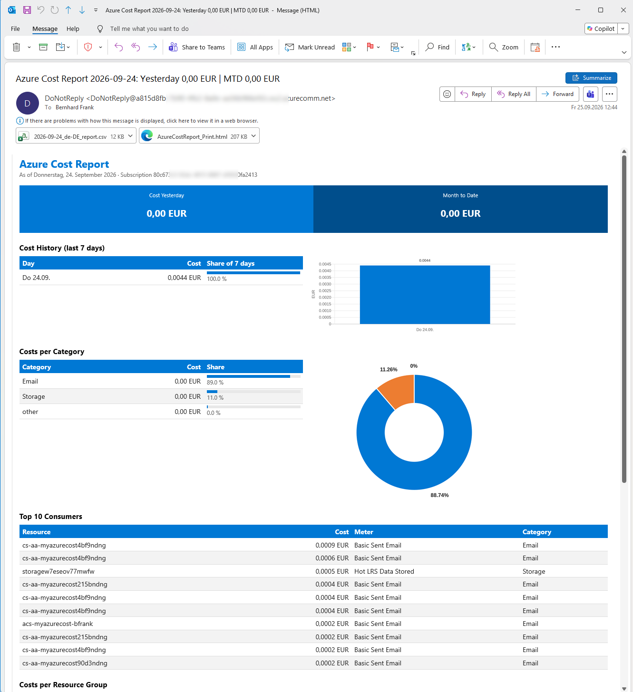
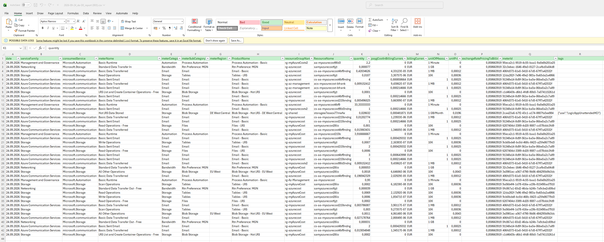
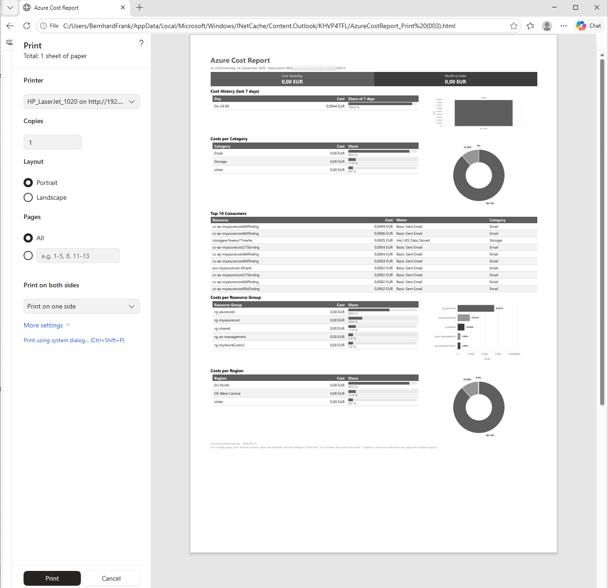
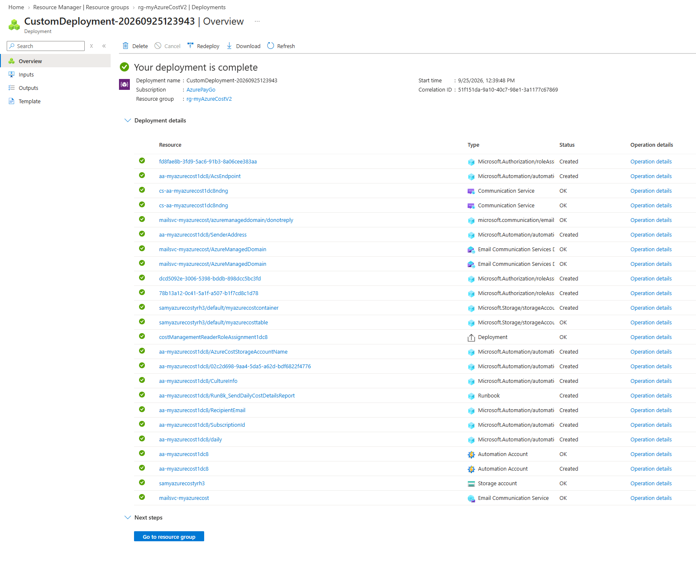

# myAzureCost (V2) Your Daily Azure Cost Email.  

Wrapping up your daily Azure consumption and cost and sending it to you via email + attached csv and printable html.

The solution uses:  
- a storage account with a table to hold every days cost (will be filled day by day)
- a communication service that will send emails to you.
- an azure automation account with a PowerShell 7.2 runbook to process the data.
- a system managed identity with minimum rights required (Cost Management Reader on subscription, Contributor on communicationServices, Storage Table Data Contributor + Storage Blob Data Contributor on storageaccount)

>Be careful not to run too many cost reports in a row (e.g. 3 in 1 minute) as Microsoft.CostManagement API will be throttled. You may need to come back 30mins to rerun. However one per day should be fine.

  

A **special thanks to [Alexander Ortha ](https://ortha-itsolutions.de/)** for the inspiration and pre-work to get this solution up and running again.

# Result & Screenshots  
  
|   |   |  | |
|--|--|--|--|
| **cost email contains graphs** | Attached a CSV with details e.g. **quantity and cost in your locale** | Attached a html for better **print** | How the deployment should look like. |
